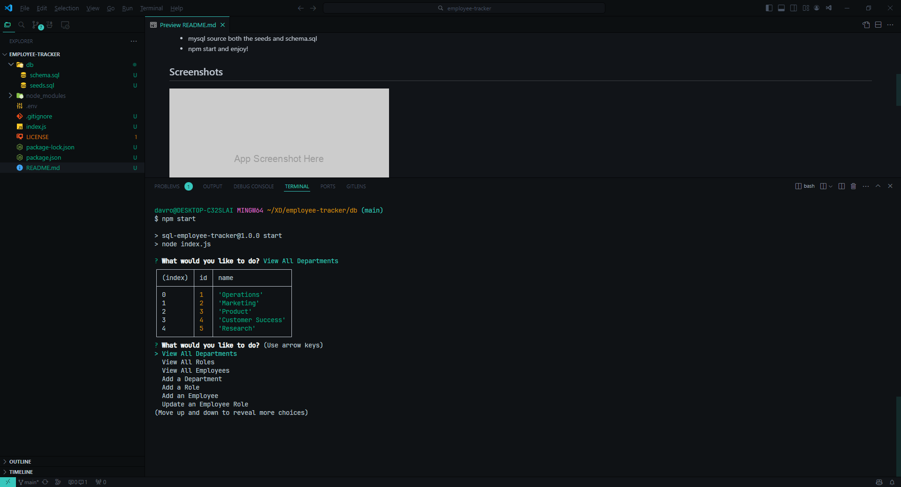

# Employee Tracker!

Our assignment for Week 12 is to create an employee tracker that'll display department, managers, roles, salaries, etc. ## Table of Contents

- [Usage](#usage)
- [Credits](#credits)
- [License](https://choosealicense.com/licenses/mit/)
- [Questions](#questions)
## Usage
- clone the repository
- In the terminal do: `npm i` to install the dependencies
- make sure to have the .env file set-up with the proper username, pw and database name
- mysql source both the seeds and schema.sql
- npm start and enjoy!

[Click here for the video!](https://youtu.be/h7TMUerngpc)

## Screenshots

## Credits

UofM-VIRT-FSF-PT-10-2023-U-LOLC-ENTG
## License

[MIT](https://choosealicense.com/licenses/mit/)

## Questions

For questions about this project, please contact [CallBeyond](https://github.com/CallBeyond) at d.robles1297@Yahoo.com.